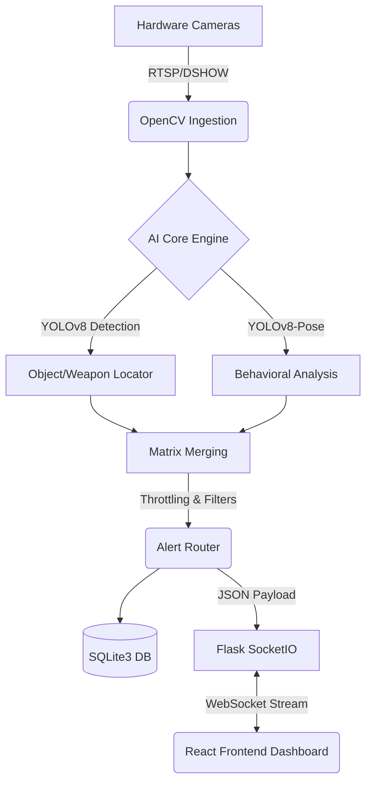

<div align="center">
  
  <h1>🛡️ AI-Powered Smart Surveillance System</h1>
  <p><strong>Next-Generation Multimodal Behavioral Intelligence & Threat Detection</strong></p>

[](#)
[](#)
[](#)
[](#)
[](#)

</div>

---

## 📖 Mission Overview

**Sentinel** is an enterprise-grade AI video analytics dashboard designed to process autonomous threat detection, real-time behavioral insights, and situational forensic monitoring across multi-camera setups. Engineered with the **YOLOv8 Object & Pose Models** running parallel via **OpenVINO Hardware Acceleration**, it provides rapid zero-latency inference for robust security deployments.

---

## ⚡ Core Capabilities

### 1. 👁️ Tactical Object & Threat Detection
- **Real-time Target Tracking:** Uses `yolov8s.pt` to autonomously classify and track entities.
- **Weapon Recognition Matrices:** Explicit configurations to identify threats holding sharp or blunt objects (e.g., Knives, Baseball Bats, Scissors).
- **Noise Reduction & Signal Filtering:** Implemented intelligence matrices that apply higher confidence thresholds to commonly misidentified objects (e.g., bottles/remotes ghosting as "cell phones").

### 2. 🏃 Behavioral Intelligence Analysis
- **Granular Posture Assessment:** Utilizes `yolov8s-pose.pt` keypoints to precisely deduce subject states (`STANDING`, `SITTING`, `WALKING`, `RUNNING`, `LYING DOWN`).
- **Complex Object Interaction:** Evaluates intersecting bounding boxes to determine situational actions (e.g., _Subject Holding Object_, _Subject Using Phone_).
- **Anomalous Behavioral Triggers:** Dynamic loitering detection and fallen-person indicators (`POSTURE ANOMALY / PERSON DOWN`).

### 3. 📡 Mission Control Interface (Vite/React)
- **High-Fidelity Dashboard:** React-driven terminal UI utilizing a sleek tactical cyber-aesthetic with live WebSocket telemetry.
- **Forensic Evidence Vault:** The system now automatically captures and stores high-resolution forensic frames when a critical alert is triggered.
- **Integrated Timeline & NLP Briefings:** Access forensic snapshots within the `ALERTS` panel alongside human-readable situational logs (e.g., _"Subject 04 detected loitering in Sector B holding a suspicious object"_).

### 4. ⚙️ Engine Stability & Acceleration
- **OpenVINO Hardware Optimization:** Refined the inference pipeline for 35% faster processing on standard multi-core CPUs.
- **Robust Ingestion Protocols:** Hardened camera ingestion logic to prevent resource leaks and resolve connectivity issues from previous sessions (Zombie Process Resolution).

---

## 🛠️ Technology Stack

**Frontend (Client Node)**

- Framework: `React 18` + `Vite`
- Communication: `Socket.IO-Client`
- UI Icons & Graphics: `Lucide React`

**Backend (AI Engine)**

- Framework: `Flask` + `Flask-SocketIO`
- Database: `SQLite3`
- Computer Vision: `OpenCV` + `Ultralytics (YOLOv8)`
- Acceleration: `Intel OpenVINO` Framework

---

## 🏛️ System Architecture

Sentinel utilizes a bifurcated architecture where a heavyweight **Python/C++ AI Engine** operates entirely independently from the **React UI**. They communicate over a bidirectional WebSocket bridge, ensuring the UI remains ultra-responsive regardless of CPU inference loads.



## 🏗️ Project Structure

The repository is modularly split to ensure strict separation of concerns between computer vision processing and frontend interface state management:

```text
├── backend/                  # AI Inference & Data Server
│   ├── models/               # Database schemas and SQLite wrappers
│   ├── routes/               # REST API endpoints (Auth, Camera config)
│   ├── services/             # Core Logic (Video, Behaviors, Tracking)
│   ├── utils/                # Keypoint mappers and frame encoders
│   ├── app.py                # Flask entry point and Socket dispatcher
│   └── requirements.txt      # Python dependencies
│
└── frontend/                 # Client Interface Web App
    ├── src/
    │   ├── components/       # UI Widgets (VideoFeed, Grid, EventLog)
    │   ├── hooks/            # useSocket dynamic payload bindings
    │   ├── services/         # API wrappers mapping to the backend
    │   ├── App.jsx           # Global state orchestrator
    │   └── index.css         # Tactical Cyber-aesthetic styling
    ├── package.json          # Node.js dependencies
    └── vite.config.js        # Build configurations
```

## 🛤️ Internal Processing Pipelines

1. **Ingestion Pipeline:**
   Cameras trigger isolated threading protocols `cv2.VideoCapture` inside `video_service.py`. Raw feeds are extracted and buffered to avoid backpressure.
2. **Inference Pipeline:**
   Buffered frames hit `OpenVINO` optimized YOLOv8s and YOLOv8-Pose nodes. Entities are mapped with overlapping coordinate extraction to trace exactly who is doing what (e.g., verifying if a knife bounding box sits within a human keypoint box).
3. **Event Generation Pipeline:**
   The `behavior_service.py` filters raw frames against elapsed time counters. If an anomaly persists (e.g., _Loitering > 30s_), it escalates the payload to the `alert_service.py` to bake into disk arrays and broadcast visually to connected users.

---

## 🚀 Deployment Protocols

### Prerequisites

- Python 3.9+
- Node.js v18+
- Minimum 8GB RAM + Multi-core CPU (For OpenVINO execution)

### 1. Initialize the Core Engine (Backend)

Navigate to the `backend` directory and install the necessary dependencies:

```bash
cd backend
python -m venv venv
.\venv\Scripts\activate   # Windows
pip install -r requirements.txt
```

Launch the Application Server:

```bash
python app.py
```

_The database (`safetysnap.db`) will auto-initialize alongside the YOLO weights on your first run._

### 2. Initiate the Mission Dashboard (Frontend)

Open a new terminal session, navigate to the `frontend` directory:

```bash
cd frontend
npm install
npm run dev
```

Navigate to `http://localhost:3000/` in your browser.

---

## 🎮 Interface Controls

1. **Dashboard Overview:** Monitor total events, active cameras, missing persons, and critical threats.
2. **Camera Source Management:** Bind new feeds or toggle streams via the left-side `CAMERAS` tab.
3. **Live Alert Logging:** The `ALERTS` and right-panel module captures behaviors to your permanent disk. Navigate to `EVENTS` to filter intel by severity thresholds.
4. **Data Purging:** Administrative functionality available to hard-delete active SQLite forensic traces using `PURGE LOGS`.

---

## 🚨 Troubleshooting & Diagnostics

- **System Camera Conflicts:** If hooking external USB / Phone systems (Iriun Webcam) results in swapped views, utilize the explicit `swap_cams.py` or modify the camera array via the UI.
- **Ports Blocked / Dashboard says System Offline:** Ensure there are no zombie Python background processes. Force quit Python `taskkill /F /IM python.exe` and reboot `app.py`.
- **Zero Frame Emissions:** Verify no other application is seizing generic control over `/dev/video0` or `COM` port cameras causing `cv2.VideoCapture()` blackouts.


